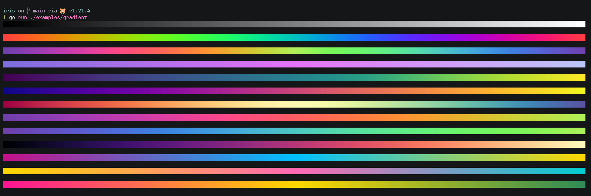
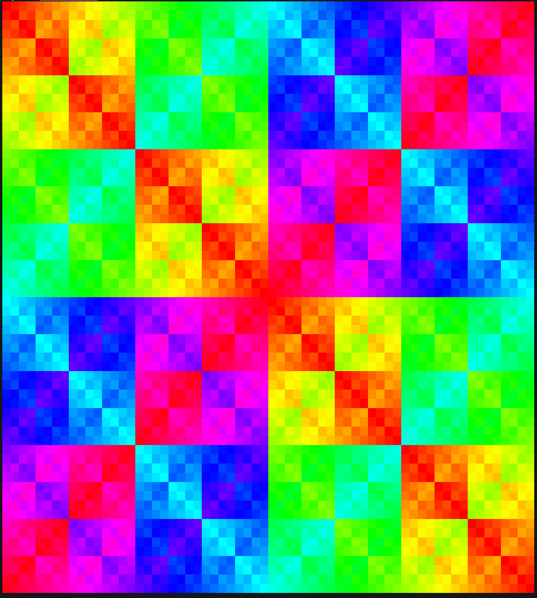
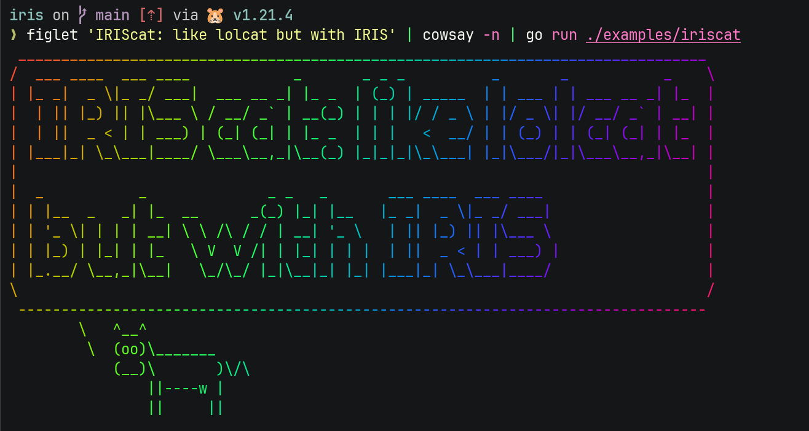

# IRIS: a low-level ANSI color manipulation library

## Principles

1. Do NOT implement rare standards (such as fraktur and blink support).
2. Favor explicit over convenient naming, e.g., use `RedFg` instead of `Red`.
3. Do NOT predefine every possible color or famous color sets (like CSS, Xterm). Assume only dynamic color usage.
4. Trust the developers. Provide unsafe methods which might cause unexpected behavior if not used with proper guarantees.
5. Allow partial styling without auto-reset. Allow developers to decide when to close styling.

## Demo

Try these examples in your terminal!

```sh
$ git clone https://github.com/abiriadev/iris && cd iris
```

### Gradient

```sh
$ go run ./examples/gradient
```



### XOR fractal

```sh
$ go run ./examples/xor
```



### IRIScat

[lolcat](https://github.com/busyloop/lolcat) implementation with IRIS.

```sh
$ figlet 'IRIScat: like lolcat but with IRIS' | cowsay -n | go run ./examples/iriscat
```


